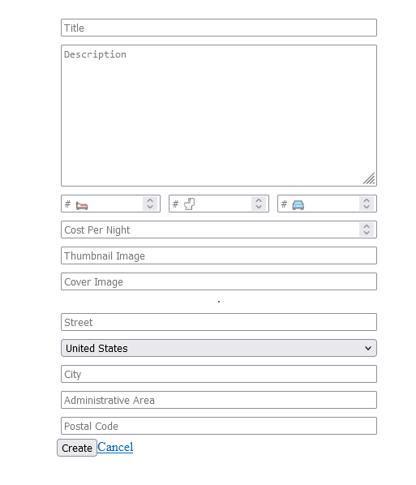
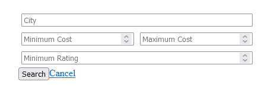
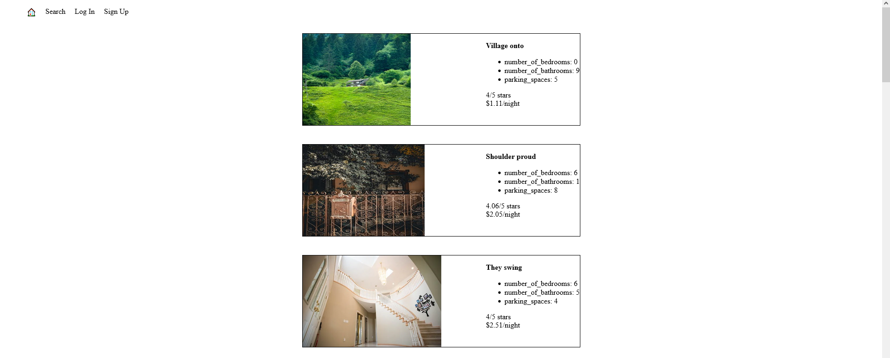

# LightBnB

Welcome to LightBnB App! This application allows users to create, manage, and browse bed and breakfast (BnB) listings. Whether you're a traveler looking for a cozy place to stay or a host wanting to showcase your property, this app has you covered.

## Features

- **User Authentication**: Secure user authentication system allowing users to sign up, log in, and manage their listings. Encrypted with bcrypt.
- **Create Listings**: Hosts can easily create new BnB listings, providing details such as property description, location, and pricing.
- **Search and Filter**: Users can search for listings based on location, dates, price range, and amenities, helping them find the perfect accommodation.

## Images
- **Add Listings**

- **Filter Listings**

- **View Properties**

## Installation

To run the app locally, follow these steps:

1.     git clone https://github.com/Ametrysinine/LightBnB lightbnb
2.     cd lightbnb
3.     npm install
4.     npm run local
5. Open your browser and visit http://localhost:3000 to view the app.
